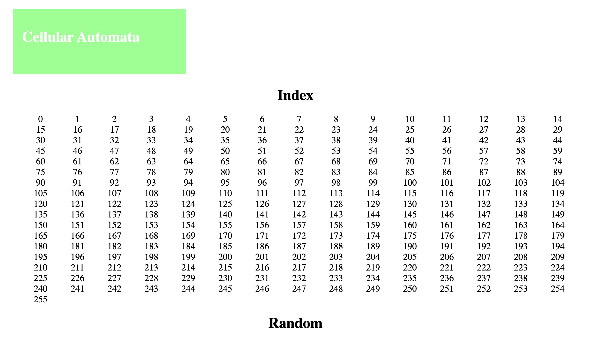
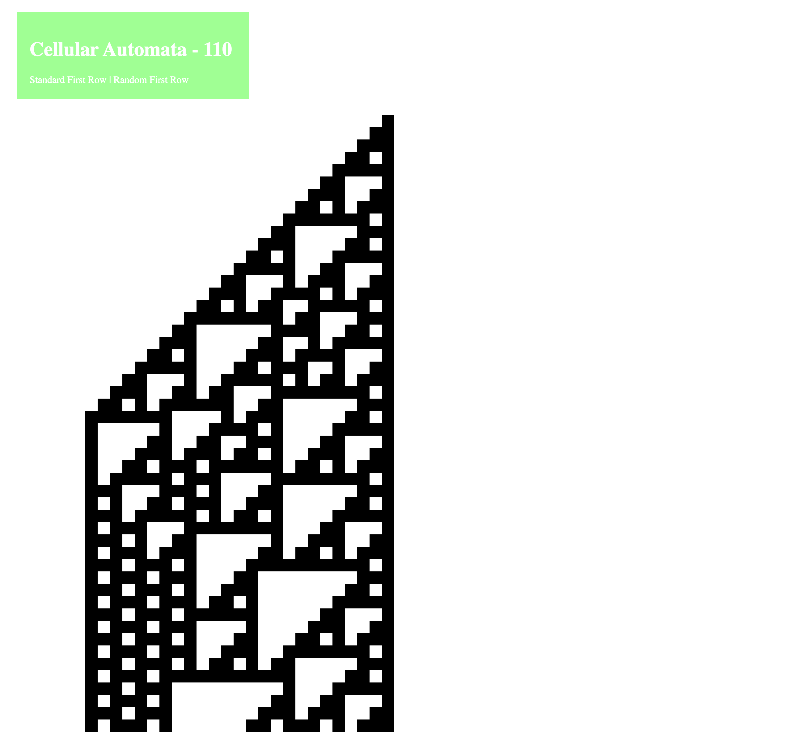
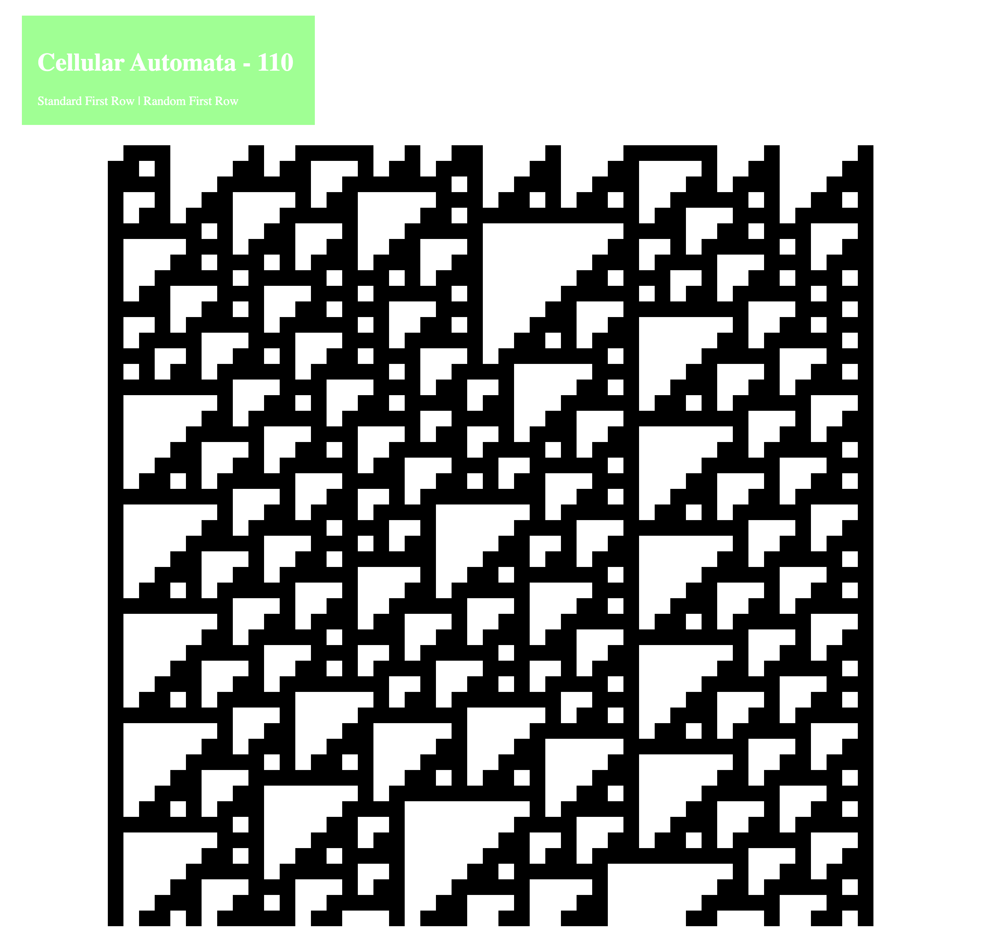
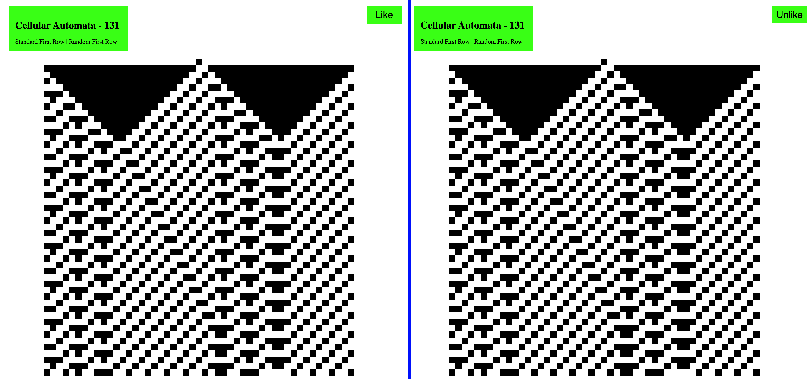
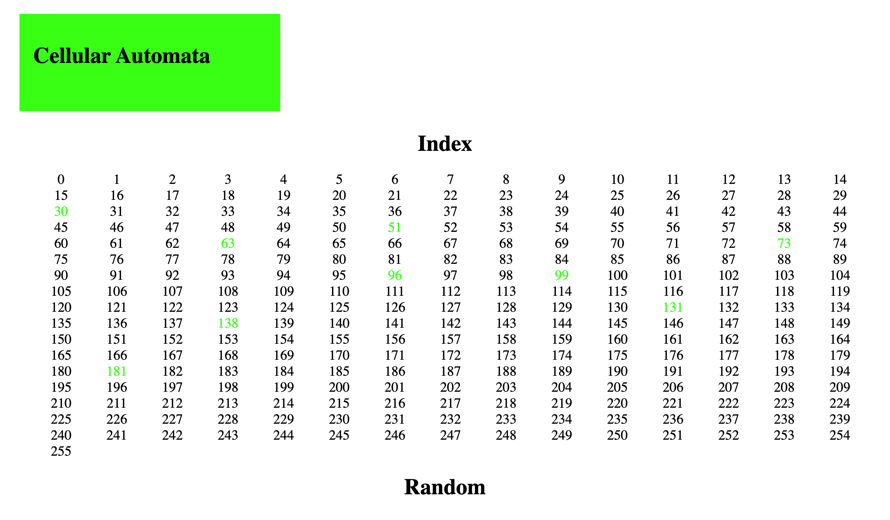

# Cellular Automata Flask App

I was reading about Wolfram Cellular Automata this last week. Never having really gone deep with coding them out, I thought this might be a fun solution to do with flask.

## Routes

### Home 
```python
@app.route("/")
def home():
    return render_template("home.html")
```
Index route displays the home template. I used the jinja for loop to create a link for every automaton. 

 
 
### Cellular Automaton
```python
@app.route('/ca/<int:number>')
def ca(number):
    board = build(number, False) #builds the ca space as a list of rows, each row is a string
    return render_template("test.html", num = number, board = board)
```
This is a dynamic route that creates an endpoint for any particular automaton that is requested, i.e. `localhost:5000/ca/110` will take you to the page for automaton 110. 
The automaton is built by a helper function then sent as a list to the template. The template then loops through the list and builds the automaton using `div` tags. 


 
### Random Automaton  
```python
@app.route('/ca/<int:number>/random')
def random_seed(number):
    board = build(number, True) #builds the ca space as a list of rows, each row is a string
    return render_template("test.html", num = number, board = board)
```
This is another dynamic route that uses the same template as the other CA route. In this instance, the helper function builds the automaton with a random seed row instead of the standard cell black cell in the middle of the CA space.  



## Updates 2-20-23, Session and POST Handling

### Likes
I created the ability for a user to "like" one of automaton rules. I did this using a form hits the server with a POST request. 
```html
      <form action="{{url_for('ca', number=num)}}" method="post">
        <input type="submit" name="submit" value="Like">
      </form>
```

I added a new route to handle the post request. I prefer to keep as little logic in the routes as possible, so I created separate routes for GET and POST rather than having an if statement inside the routes.
```python
@app.get('/ca/<int:number>')
def ca(number):
    board = build(number, False) #builds the ca space as a list of rows, each row is a string 
    return render_template("automata.html", num = number, board = board, sesh=session)
 
@app.post('/ca/<int:number>')
def ca_post(number):
    # print(request.form['submit'])
    if "likes" not in session:  #add a likes key to session if there isn't one
        session["likes"] = {}

    l = session["likes"] #temp copy of likes

    if request.form['submit'] == "Unlike": #if a ca is unliked, pop it from the list
        l.pop(str(number)) 
    else:
        l[str(number)] = True #meaning it has been liked, so add a key with value == true
    
    session["likes"] = l #set session to the updated copy of likes
    # return render_template("test.html", session=session)
    return redirect(url_for('.ca', number = number))
```

I wanted the user to be able to change their mind, so the post request checks which button was pressed, and changes the status of the like accordingly.

On the template side, I'm using in `if` to see whether or not a automaton has been liked. If it has not, it will display the like button. If it is already liked, it will display the unlike button. 

Here is that part of the template.
```html
    
      <form action="{{url_for('ca', number=num)}}" method="post">
        <input type="submit" name="submit" value="Unlike">
      </form>
    
      <form action="{{url_for('ca', number=num)}}" method="post">
        <input type="submit" name="submit" value="Like">
      </form>
    
```
 


### Home Styling
I added some conditional styling on the home page. If the cellular automaton has been liked, I added a class name to display the number as green.

Here is a snippet from the home template that handles that.
```html
<a class="{{'liked' if i|string in sesh["likes"]}}" href="/ca/{{i}}">{{i}}</a>
```


